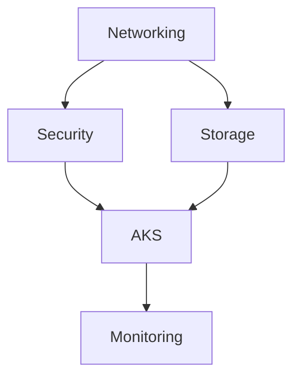

# 🚀 HadAndHez AKS Infrastructure

> Production-ready Azure Kubernetes Service (AKS) infrastructure using Terraform with enterprise-grade security and monitoring.

[](https://azure.microsoft.com/)
[](https://terraform.io/)
[](https://kubernetes.io/)

## 📋 Table of Contents

- [Overview](#overview)
- [Architecture](#architecture)
- [Prerequisites](#prerequisites)
- [Quick Start](#quick-start)
- [Configuration](#configuration)
- [Deployment](#deployment)
- [Security](#security)
- [Monitoring](#monitoring)
- [Troubleshooting](#troubleshooting)
- [Contributing](#contributing)

## 🏗️ Overview

This repository contains Terraform infrastructure as code (IaC) for deploying a production-ready Azure Kubernetes Service (AKS) cluster with:

- **Enterprise Security**: Private cluster, Azure AD integration, RBAC
- **Monitoring & Observability**: Azure Monitor, Log Analytics, Application Insights
- **Networking**: Custom VNet, DDoS protection, Network Security Groups
- **Storage**: Azure Files, persistent volumes
- **Compliance**: Cost center tagging, governance policies

### Key Features

✅ **Private AKS Cluster** - Enhanced security with private API server  
✅ **Azure AD Integration** - Enterprise identity management  
✅ **Comprehensive Monitoring** - Azure Monitor Container Insights  
✅ **Network Security** - DDoS protection and flow logs  
✅ **Automated Deployment** - PowerShell deployment scripts  
✅ **Modular Architecture** - Reusable Terraform modules  

## 🏛️ Architecture

```
┌─────────────────────────────────────────────────────────────┐
│                    Azure Subscription                       │
│  ┌─────────────────────────────────────────────────────────┐ │
│  │                Resource Group                           │ │
│  │  ┌─────────────────┐  ┌─────────────────┐              │ │
│  │  │   Virtual       │  │   AKS Cluster   │              │ │
│  │  │   Network       │  │   (Private)     │              │ │
│  │  │   10.0.0.0/16   │  │                 │              │ │
│  │  └─────────────────┘  └─────────────────┘              │ │
│  │  ┌─────────────────┐  ┌─────────────────┐              │ │
│  │  │   Log Analytics │  │   Key Vault     │              │ │
│  │  │   Workspace     │  │                 │              │ │
│  │  └─────────────────┘  └─────────────────┘              │ │
│  └─────────────────────────────────────────────────────────┘ │
└─────────────────────────────────────────────────────────────┘
```

## 🔧 Prerequisites

### Required Tools

- **Azure CLI** (≥ 2.60.0)
- **Terraform** (≥ 1.6.0)
- **PowerShell** (≥ 7.0)
- **kubectl** (≥ 1.28)
- **Git** (for version control)

### Azure Requirements

- Azure subscription with appropriate permissions
- Azure AD tenant access
- Service Principal with Contributor role

### Installation Commands

```powershell
# Install Azure CLI
winget install Microsoft.AzureCLI

# Install Terraform
winget install Hashicorp.Terraform

# Install kubectl
az aks install-cli

# Verify installations
az version
terraform version
kubectl version --client
```

## 🚀 Quick Start

### 1. Clone Repository

```powershell
git clone https://github.com/your-username/hadandhed-aks-infrastructure.git
cd hadandhed-aks-infrastructure
```

### 2. Configure Environment

```powershell
# Copy example configuration
cp terraform.tfvars.example terraform.tfvars

# Edit configuration (see Configuration section)
code terraform.tfvars
```

### 3. Initialize Terraform

```powershell
terraform init
```

### 4. Deploy Infrastructure

```powershell
# Deploy using the automated script
.\scripts\deploy.ps1
```

## ⚙️ Configuration

### terraform.tfvars

```hcl
# Environment Configuration
environment = "prod"
location    = "UK South"
owner       = "your-email@company.com"

# AKS Configuration
node_count             = 1
node_vm_size           = "Standard_B1s"
kubernetes_version     = "1.32.0"
private_cluster_enabled = true

# Security Configuration
admin_group_object_ids = ["your-admin-group-id"]
```

### Key Configuration Options

| Variable | Description | Default | Required |
|----------|-------------|---------|----------|
| `environment` | Environment (dev/staging/prod) | - | ✅ |
| `location` | Azure region | UK South | ✅ |
| `node_count` | Number of worker nodes | 1 | ✅ |
| `node_vm_size` | VM size for nodes | Standard_B1s | ✅ |
| `admin_group_object_ids` | Azure AD admin groups | - | ✅ |

## 🚀 Deployment

### Method 1: Automated Script

```powershell
# Full deployment
.\scripts\deploy.ps1

# Destroy infrastructure
.\scripts\destroy.ps1
```

### Method 2: Manual Terraform

```powershell
# Initialize
terraform init

# Plan
terraform plan -var-file="terraform.tfvars" -out=tfplan

# Apply
terraform apply tfplan

# Destroy (when needed)
terraform destroy -var-file="terraform.tfvars"
```

### Post-Deployment

```powershell
# Get AKS credentials
az aks get-credentials --resource-group rg-hadandhed-aks-prod --name aks-hadandhed-prod

# Verify cluster access
kubectl get nodes

# Check cluster info
kubectl cluster-info
```

## 🔐 Security

### Security Features

- **Private Cluster**: API server accessible only from private network
- **Azure AD Integration**: Enterprise identity and access management
- **RBAC**: Role-based access control for fine-grained permissions
- **Network Security**: NSGs and Azure Firewall integration
- **Key Vault**: Secure storage of secrets and certificates

### Security Best Practices

1. **Never commit secrets** to version control
2. **Use Azure Key Vault** for all application secrets
3. **Enable Azure Defender** for container security
4. **Regular security updates** for cluster nodes
5. **Implement pod security standards**

### Important Files to Secure

```
⚠️ NEVER COMMIT THESE FILES:
- terraform-credentials.env
- *.tfstate
- *.tfstate.backup
- Any files containing passwords/keys
```

## 📊 Monitoring

### Included Monitoring Solutions

- **Azure Monitor Container Insights**
- **Log Analytics Workspace**
- **Application Insights**
- **Prometheus & Grafana** (optional)

### Key Metrics Monitored

- Node and pod health
- Resource utilization
- Application performance
- Security events
- Cost optimization

### Accessing Monitoring

```powershell
# View cluster metrics in Azure Portal
az aks show --resource-group rg-hadandhed-aks-prod --name aks-hadandhed-prod --query "addonProfiles.omsagent"

# Get Log Analytics workspace
az monitor log-analytics workspace list --resource-group rg-hadandhed-aks-prod
```

## 🛠️ Module Structure

```
modules/
├── aks/              # AKS cluster configuration
├── networking/       # VNet, subnets, NSGs
├── security/         # Key Vault, RBAC
├── monitoring/       # Log Analytics, monitoring
└── storage/          # Storage accounts, file shares
```

### Module Dependencies



## 🐛 Troubleshooting

### Common Issues

#### Issue: Terraform state lock

```powershell
# Solution: Break the lease
az storage blob lease break --blob-name terraform.tfstate --container-name tfstate --account-name <storage-account>
```

#### Issue: AKS node provisioning fails

```powershell
# Check quota limits
az vm list-usage --location "UK South" --output table

# Check available VM sizes
az vm list-sizes --location "UK South" --output table
```

#### Issue: kubectl connection timeout

```powershell
# Re-authenticate and get credentials
az login
az aks get-credentials --resource-group rg-hadandhed-aks-prod --name aks-hadandhed-prod --overwrite-existing
```

### Debug Commands

```powershell
# Terraform debug
$env:TF_LOG = "DEBUG"
terraform plan

# Azure CLI debug
az aks show --resource-group rg-hadandhed-aks-prod --name aks-hadandhed-prod --debug

# Kubernetes debug
kubectl get events --sort-by=.metadata.creationTimestamp
```

## 🤝 Contributing

1. **Fork** the repository
2. **Create** a feature branch (`git checkout -b feature/amazing-feature`)
3. **Commit** your changes (`git commit -m 'Add amazing feature'`)
4. **Push** to the branch (`git push origin feature/amazing-feature`)
5. **Open** a Pull Request

### Development Guidelines

- Follow Terraform best practices
- Include appropriate documentation
- Test all changes in a dev environment
- Update README.md if needed

## 📚 Additional Resources

- [Azure AKS Documentation](https://docs.microsoft.com/en-us/azure/aks/)
- [Terraform Azure Provider](https://registry.terraform.io/providers/hashicorp/azurerm/latest/docs)
- [Kubernetes Documentation](https://kubernetes.io/docs/)
- [Azure Architecture Center](https://docs.microsoft.com/en-us/azure/architecture/)

## 📄 License

This project is licensed under the MIT License - see the [LICENSE](LICENSE) file for details.

## 📞 Support

For support and questions:

- **Primary Contact**: Jay@hadandhez.co.uk
- **Project**: AKS-Production
- **Cost Center**: IT-Infrastructure

---

**⭐ If this project helped you, please consider giving it a star!**

---

> **Note**: This infrastructure is configured for production use. Please review all settings before deployment and ensure they meet your organization's requirements.
